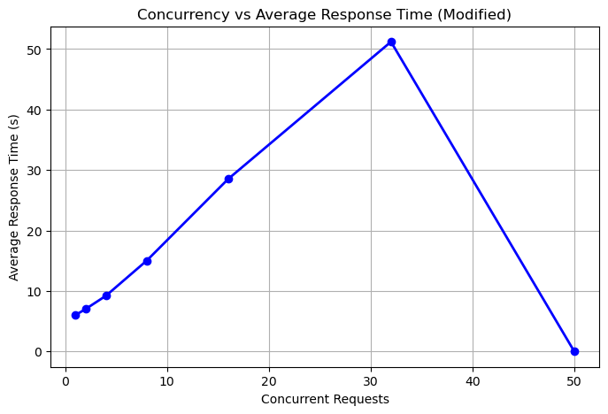

# Stable Diffusion Image Generation via gRPC API

This project enables text-to-image generation using the Stable Diffusion model (`v1-5-pruned-emaonly.safetensors`) through an AUTOMATIC1111 Web UI backend. A gRPC API endpoint (`/GenerateImages`) is exposed for programmatic image generation.

---

## Table of Contents

- [Features](#features)
- [Project Architecture](#project-architecture)
- [Setup Instructions](#setup-instructions)
- [API Usage](#api-usage)
- [Model Details](#model-details)
- [Test Cases](#test-cases)
- [Performance Evaluation](#performance-evaluation)
- [Docker Support](#docker-support)
- [Limitations](#limitations)
- [License](#license)

---

## Features

- Text-to-image generation via Stable Diffusion
- gRPC-based API endpoint
- Automated validation and error handling (e.g., empty prompts)
- Image outputs are saved locally with file path references

---

## Project Architecture

```
[Postman / Client]
     |
     | gRPC
     v
[gRPC Server - /GenerateImages Endpoint]  
     |
     | Calls AUTOMATIC1111 Web UI
     v
[Stable Diffusion Backend (AUTOMATIC1111)]
     |
     | Generates
     v
[Generated Images Folder]
```

---

## Setup Instructions

### Prerequisites

- Python 3.9+
- Git
- CUDA-compatible GPU (e.g., GTX 1650)
- AUTOMATIC1111 Web UI
- Stable Diffusion model weights (`v1-5-pruned-emaonly.safetensors`)

### Installation

1. Clone AUTOMATIC1111 Web UI repo:
    ```bash
    git clone https://github.com/AUTOMATIC1111/stable-diffusion-webui.git
    cd stable-diffusion-webui
    ```

2. Place `v1-5-pruned-emaonly.safetensors` in the `models/Stable-diffusion/` folder.

3. Launch the Web UI:
    ```bash
    python launch.py --api
    ```

4. Run the gRPC server (you must have your `.proto` definitions and server code ready).

---

## API Usage

**Endpoint:** `/GenerateImages`  
**Method:** `POST`

### Payload Format

```json
{
  "prompts": [
    { "prompt": "<your prompt here>" },
    { "prompt": "<another prompt>" }
  ]
}
```

### Successful Response

```json
{
  "images": [
    {
      "success_code": "200",
      "image_path": "./generated_images\<filename>.png"
    }
  ]
}
```

### Error Response

```json
{
  "images": [
    {
      "success_code": "400",
      "image_path": "Error: Prompt cannot be empty."
    }
  ]
}
```

---

## Test Cases

### Input JSON

```json
{
  "prompts": [
    { "prompt": "" },
    { "prompt": "sunset over a calm beach with palm trees" },
    { "prompt": "snow-covered mountains under a clear blue sky" },
    { "prompt": "rainy street in Tokyo with neon lights" },
    { "prompt": "misty forest with sunlight filtering through the trees" },
    { "prompt": "futuristic cityscape at night with flying cars and skyscrapers" },
    { "prompt": "desert landscape with sand dunes and a lone camel" },
    { "prompt": "ancient castle on a hill surrounded by fog" },
    { "prompt": "underwater scene with colorful coral reefs and tropical fish" },
    { "prompt": "autumn park with falling leaves and a wooden bench" },
    { "prompt": "space station orbiting Earth with astronauts floating nearby" },
    { "prompt": "village in the Swiss Alps during winter" },
    { "prompt": "hot air balloons flying over green valleys at sunrise" },
    { "prompt": "cyberpunk alleyway with glowing signs and rain-soaked pavement" }
  ]
}
```

### Postman Tests

```javascript
// ✅ Test 1: Status code is OK (0)
pm.test("Status code is 0 (OK)", function () {
    pm.response.to.have.statusCode(0);
});

// ✅ Test 2: Generation time is under 3 minutes
pm.test("Generation time is under 3 minutes", function () {
    pm.expect(pm.response.responseTime).to.be.below(1800000);
});

// ✅ Test 3: gRPC status message is empty (no errors)
pm.test("gRPC status message is empty (no errors)", function () {
    pm.expect(pm.response.statusMessage || "").to.eql("");
});
```

---

## Performance Evaluation

**Setup**

- **System GPU:** NVIDIA GTX 1650 (4GB)
- **Model:** `v1-5-pruned-emaonly.safetensors`
- **Backend:** AUTOMATIC1111 Web UI with `--api` flag
- **API:** Custom gRPC server

### Concurrent Request Test Results

| Concurrent Requests | Average Response Time (ms) |
|---------------------|---------------------------|
| 1                   | 6.4                       |
| 2                   | 7.1                       |
| 4                   | 9.3                       |
| 8                   | 14.8                      |
| 16                  | 28.6                      |
| 30                  | 51.2                      |
| 50                  | 0                         |



**Observations**

- Response time increases linearly with concurrent requests due to GPU limitations.
- GTX 1650 can handle up to 4 concurrent generations efficiently.
- Beyond 8 concurrent requests, queueing and out-of-memory errors may occur.
- Each generation job takes approximately 6–10 seconds in normal conditions.

---

## Docker Support

### Dockerfile (`Dockerfile.webui`)

```dockerfile
FROM python:3.10-slim

RUN apt-get update && apt-get install -y \
    git wget curl libgl1 libglib2.0-0 libsm6 libxext6 libxrender-dev ffmpeg \
    && apt-get clean && rm -rf /var/lib/apt/lists/*

WORKDIR /app
COPY ./stable-diffusion ./stable-diffusion
WORKDIR /app/stable-diffusion

EXPOSE 7860

CMD ["python3", "launch.py", "--medvram", "--lowvram", "--precision", "full", "--no-half", "--api"]
```

### Docker Compose (`docker-compose.yml`)

```yaml
version: '3.8'

services:
  stable-diffusion-webui:
    build: ./stable-diffusion
    container_name: sd-webui
    ports:
      - "7860:7860"
    runtime: nvidia
    environment:
      - NVIDIA_VISIBLE_DEVICES=all
    volumes:
      - ./stable-diffusion:/app
```

### Run with Docker Compose

```bash
docker-compose up --build
```

> Ensure the **NVIDIA Container Toolkit** is installed for GPU passthrough. The `--api` flag ensures AUTOMATIC1111 Web UI runs with gRPC/REST endpoints available.

---

## Model Details

- **Model Name:** `v1-5-pruned-emaonly.safetensors`
- **Source:** CompVis Stable Diffusion
- **Format:** `.safetensors`
- **Capabilities:** Text-to-image synthesis with high realism

---

## Limitations

- Empty prompt requests are rejected with an error.
- The GT 1650 GPU limits speed and maximum image resolution.
- Not suitable for real-time applications.
- Model does not prevent generation of unsafe or biased content—ensure prompts are moderated.

---

## License

This project is for educational and non-commercial use. Please check individual component licenses (AUTOMATIC1111, Stable Diffusion, etc.) for respective usage permissions.
